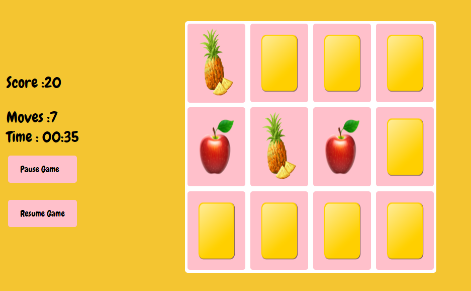

# :pineapple: :watermelon: :grapes:  Truthy Fruity :strawberry: :apple: :tangerine:

## :pushpin: About 
The trivial memory game project is a great chance to integrate your knowledge of HTML, CSS, and JavaScript into a cohesive application. It helps you get better at these skills and shows you how to make a complicated application using them. You'll figure out the best way to work on the project, decide how many files you need, and decide whether to start with HTML, CSS, or JavaScript first. This project will enable you to explore various approaches and determine the most effective one for you.

## :clipboard: How to play 
In this game, you'll see twelve cards laid out randomly on a board. Your goal is to keep flipping over pairs of cards until you've matched all six pairs.

- Each card has a different fruits on one side. The objective is to find all six pairs of matching cards by turning over two cards at a time.
- On each turn, you'll flip over one card to reveal the symbol on its other side.
- Then, you'll flip over a second card to see if it matches the first card.
- If the cards match, they'll stay face-up on the board. If not, both cards will be turned back over to their hidden state.
- Once all the pairs have been matched, the game is over and If you want to play again, you may click on 'Wanna play again' link.

## :rocket: Demo 
Here is the link that you can check my demo version of my game :arrow_right:
 [Truthy Fruity]( https://tunaerkmen.github.io/MyGame-/)

 ## :paperclip: Further Improvements
 - Add Level 2, 
 - Add more cards and time limit,
 - Make the game responsive,
 - Add more interactions with user.
